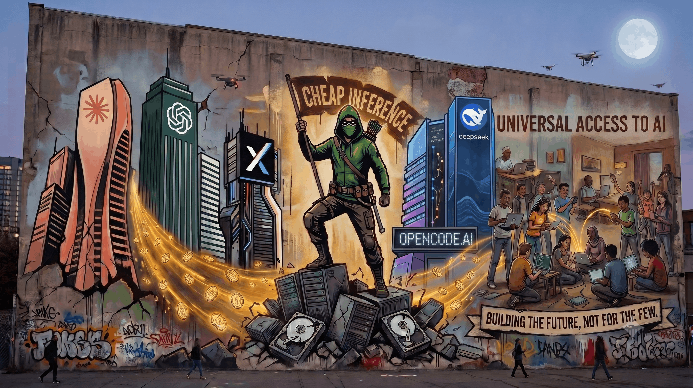

<p align="center">
  
</p>

# Awesome AI Coding on a Budget 🚀

[](https://github.com/mrtnrocks/awesome-ai-coding-on-a-budget)
[](https://opensource.org/licenses/MIT)
[](https://github.com/mrtnrocks/awesome-ai-coding-on-a-budget)
[](https://github.com/mrtnrocks/awesome-ai-coding-on-a-budget/issues/1)

> A curated, empirical guide and architectural landscape for developer-centric, high-efficiency AI software engineering. Eliminate "vibe coding" slop, prune token overhead by up to 90%, leverage local inference runtimes, and maximize intelligence-per-dollar across multi-agent workflows.

---

## Table of Contents

- [1. Model Selection & Benchmarking](#1-model-selection--benchmarking)
  - [Core Benchmarking & Intelligence Indexes](#core-benchmarking--intelligence-indexes)
  - [The 3-Tier Budget Model Strategy](#the-3-tier-budget-model-strategy)
  - [Empirical Selection Guidelines](#empirical-selection-guidelines)
- [2. LLM Gateways, Routing, API Proxies & Multi-Account Rotation](#2-llm-gateways-routing-api-proxies--multi-account-rotation)
  - [Open-Source AI Gateway & Proxy Matrix](#open-source-ai-gateway--proxy-matrix)
  - [Core Gateway & Proxy Deep Dives](#core-gateway--proxy-deep-dives)
  - [Multi-Account Account Rotation Strategies](#multi-account-account-rotation-strategies)
  - [Managed Cloud Routers & Intelligent Dispatchers](#managed-cloud-routers--intelligent-dispatchers)
  - [Telemetry, Spend Tracking & Usage Analytics](#telemetry-spend-tracking--usage-analytics)
- [3. Token Optimization & Prompt Compression](#3-token-optimization--prompt-compression)
  - [Token Compression & Optimization Tool Matrix](#token-compression--optimization-tool-matrix)
  - [Input Prompt Compression & Context Reduction](#input-prompt-compression--context-reduction)
  - [Output Token Minimization & Anti-Bloat Techniques](#output-token-minimization--anti-bloat-techniques)
  - [Recommended Production Recipe](#recommended-production-recipe)
- [4. Codebase Intelligence, RAG & MCP Context Preservation](#4-codebase-intelligence-rag--mcp-context-preservation)
  - [Codebase Intelligence & RAG Tool Matrix](#codebase-intelligence--rag-tool-matrix)
  - [Deep Dive: Core Codebase Intelligence Engines](#deep-dive-core-codebase-intelligence-engines)
  - [Model Context Protocol (MCP) Architecture](#model-context-protocol-mcp-architecture)
  - [Practical MCP Setup Configuration](#practical-mcp-setup-configuration)
- [5. Agent Harnesses, Skills & Quality Guardrails ("Fixing Vibe Coding")](#5-agent-harnesses-skills--quality-guardrails-fixing-vibe-coding)
  - [Quality Guardrail & Harness Tool Matrix](#quality-guardrail--harness-tool-matrix)
  - [Agent Harnesses & Composable Skills](#agent-harnesses--composable-skills)
  - [Static Linters, AST Guardrails & Runtime Telemetry](#static-linters-ast-guardrails--runtime-telemetry)
  - [Headless Browser Execution & Visual Verification](#headless-browser-execution--visual-verification)
  - [The 8 Tech Choices Before "Agentmaxxing"](#the-8-tech-choices-before-agentmaxxing)
- [6. Local Runtimes & Self-Hosted Inference](#6-local-runtimes--self-hosted-inference)
  - [Local Runtime & Self-Hosted Inference Matrix](#local-runtime--self-hosted-inference-matrix)
  - [Deep Dive: Core Local & Self-Hosted Engine Suite](#deep-dive-core-local--self-hosted-engine-suite)
  - [Quantization & Hardware Sizing Reference](#quantization--hardware-sizing-reference)
  - [Best Practices for Local & Self-Hosted AI Coding](#best-practices-for-local--self-hosted-ai-coding)
- [7. Pricing Intelligence, Deals & Grey Market Awareness](#7-pricing-intelligence-deals--grey-market-awareness)
  - [Pricing Intelligence & Grant Matrix](#pricing-intelligence--grant-matrix)
  - [Deep Dive: Pricing Intelligence, Grants & Risk Safeguards](#deep-dive-pricing-intelligence-grants--risk-safeguards)
  - [Economic Decision Architecture](#economic-decision-architecture)
  - [Official Deal & Grant Qualification Matrix](#official-deal--grant-qualification-matrix)
- [Contributing & Community](#contributing--community)
- [License](#license)

---

## 1. Model Selection & Benchmarking

Selecting the right LLM for AI-assisted engineering requires balancing intelligence, task-specific capabilities, execution speed, and token cost. By cross-referencing human preference leaderboards, specialized software engineering benchmarks, and real-time pricing indices, developers can build a Pareto-optimal model matrix that minimizes API spend while maximizing code quality.

### Core Benchmarking & Intelligence Indexes

* **[LMSYS Chatbot Arena Leaderboard](https://arena.ai/leaderboard)**: Crowdsourced, blind A/B Elo ratings. Filter by the **Coding** and **Hard Prompts** sub-view to assess real-world human preference for code generation and debugging over raw benchmark scores.
* **[DeepSWE Leaderboard](https://deepswe.datacurve.ai)**: Benchmark specifically measuring repository-level software engineering performance (resolving complex issues, agentic bug fixes, unit test execution). Essential for evaluating agentic harness capabilities beyond single-file code completion.
* **[Artificial Analysis](https://artificialanalysis.ai/#price-and-cost)**: Independent metric tracking of LLM performance vs. economic cost. Provides real-time metrics on:
  * Quality Index vs. Price (per 1M input/output tokens)
  * Output Speed (Tokens per second)
  * Latency (Time-to-First-Token / TTFT)
* **[Models.dev](https://models.dev)** ([GitHub](https://github.com/opencode-ai/models)): Open-source, developer-first database and JSON API detailing model specs, context limits, provider endpoints, and exact token pricing across providers.

---

### The 3-Tier Budget Model Strategy

Rather than routing every request to expensive flagship models, structure agent operations into three distinct cost/capability tiers:

| Tier | Primary Use Case | Recommended Pareto-Optimal Models | Benchmark & Cost Focus |
| :--- | :--- | :--- | :--- |
| **Tier 1: High-Reasoning & Architecture** | Spec creation, system architecture, root-cause diagnosis across large codebases, complex refactoring | Claude 3.7 Sonnet, OpenAI o3-mini, Gemini 2.5 Pro, DeepSeek-R1 | DeepSWE / LMSYS Coding top scores; used sparingly for planning and complex fixes. |
| **Tier 2: Routine Execution & Component Dev** | Feature implementation, test-driven development (TDD), API integration, code review | DeepSeek-V3, Qwen-2.5-Coder-32B, Claude 3.5 Haiku, Gemini 2.5 Flash | High Artificial Analysis speed/cost efficiency ($0.05–$0.30 / 1M tokens). |
| **Tier 3: Autocomplete & Background Tasks** | Inline code completion, docstring generation, linter warning fixes, git commit messages | Qwen-2.5-Coder-7B/14B (Local/Ollama), Llama-3.3-70B (Free tier endpoints), DeepSeek-V3 | Near-zero or zero API cost; ultra-low latency (<500ms TTFT). |

---

### Empirical Selection Guidelines

1. **Cross-Reference Quality with Pricing**: Never pick a model based purely on Elo rank. Compare LMSYS/DeepSWE ranks against Artificial Analysis cost charts to identify models on the Pareto frontier (e.g., DeepSeek-R1 and Qwen-2.5-Coder offering 90%+ of flagship performance at <10% of the cost).
2. **Programmatic Route Weighting**: Consume the `models.dev` JSON API inside custom gateways (e.g., OmniRoute, LiteLLM) to dynamically route fallback chains to the lowest-cost provider serving the required model tier.
3. **Match Model to Task Context**: Use fast, cheap models (Tier 2/3) for iterative inner-loop development (e.g., unit test fixes), escalating to Tier 1 reasoning models only when tests fail repeatedly or structural architectural decisions are required.

---

## 2. LLM Gateways, Routing, API Proxies & Multi-Account Rotation

Running AI-assisted coding tools at scale requires resilient API infrastructure. Local gateways and proxy daemons allow developers to pool free API tiers, balance traffic across multiple accounts, compress prompt payloads, and automatically fall back to alternative models when primary endpoints hit rate limits.

---

### Open-Source AI Gateway & Proxy Matrix

| Feature / Metric | OmniRoute | 9router | CLIProxyAPI | LiteLLM | Manifest |
| :--- | :--- | :--- | :--- | :--- | :--- |
| **Primary Language** | TypeScript / Node.js | TypeScript / Node.js | **Go** (Golang) | **Python** | TypeScript / Node.js |
| **Primary Focus** | Free-tier pooling & CLI setup | Context token optimization | Multi-account OAuth load balancing | Enterprise backend proxy & governance | Agent routing & request auto-fix |
| **Provider Support** | **290+ providers** (90+ free) | 40+ providers | OAuth + major LLM APIs | 100+ LLM providers | 300+ models (32 providers) |
| **Token Saver Tech** | RTK + Caveman compression | RTK, Caveman, Ponytail, Headroom | Pure pass-through | Caching only | Full-body logging & cost tracking |
| **Multi-Account OAuth** | Supported (visual dashboard) | Supported (Round-robin) | **Best-in-class** (Instant 429 retry) | Virtual Keys & Team Budgets | Tiered API key fallback |
| **GUI / Dashboard** | Built-in Next.js App (`:20128`) | Built-in Next.js App (`:20128`) | Separate Docker UI | Streamlit / Web UI | Web Portal (`manifest.build`) |
| **CLI Setup Helpers** | `omniroute setup-claude`, `launch-codex` | Manual config / CLI launch scripts | Terminal flags (`--claude-login`) | Config via `config.yaml` | Config via YAML / CLI |
| **Resource Footprint** | Medium (Node.js + Web UI) | Medium (Node.js + Web UI) | **Ultra-low** (Single binary) | Medium (Python + Postgres/Redis) | Lightweight |

---

### Core Gateway & Proxy Deep Dives

* **[OmniRoute](https://github.com/diegosouzapw/OmniRoute)** ([omniroute.online](https://omniroute.online)): Free MIT AI gateway aggregating 290+ providers and 90+ zero-config free tiers (yielding up to 1.5B free tokens/month). Features an embedded Next.js visual dashboard, out-of-the-box launcher helpers (`omniroute setup-claude`), built-in RTK/Caveman token compression, and MCP server support.
* **[9router](https://github.com/decolua/9router)**: Terminal-focused proxy designed for pay-per-token developers. Includes specialized token-reducing engines (**RTK** for stripping git diff noise, **Caveman Mode** for concise LLM output, **Ponytail Mode** for YAGNI-first code generation, and **Headroom**).
* **[CLIProxyAPI](https://github.com/router-for-me/CLIProxyAPI)**: Blazing-fast background daemon written in Go. Ideal for developers with multiple paid subscriptions (e.g. 2x Claude Pro accounts); intercepts API calls at `localhost:8317` and performs transparent, sub-second retries with alternate credentials on HTTP 429 rate limit errors.
* **[LiteLLM](https://github.com/BerriAI/litellm)**: The industry-standard Python proxy for backend engineering. Normalizes 100+ LLM provider APIs into unified OpenAI format, providing virtual API keys, team spend caps, load balancing, and enterprise governance.
* **[Manifest](https://github.com/mnfst/manifest)** ([manifest.build](https://manifest.build/)): Open-source LLM router designed specifically for AI agents, supporting 300+ models across 32 providers with custom routing rules, full-body payload logging, cost tracking, and on-the-fly request auto-fix.

---

### Multi-Account Account Rotation Strategies

Managing multiple developer subscriptions (e.g., 2+ Claude Code accounts to bypass the 5-hour quota limit) can be handled at three architectural levels depending on proxy overhead preferences:

| Approach | Tool | Mechanism | Network Proxy? | Key Advantage |
| :--- | :--- | :--- | :--- | :--- |
| **Native Profile Swapper** | **[claude-swap](https://github.com/Alishahryar1/free-claude-code)** (`cswap`) | Swaps `~/.claude.json` profile credentials proactively based on quota threshold (`cswap auto`). | No (Direct connection) | 100% native CLI behavior; zero proxy latency; supports per-terminal isolation (`cswap run 2`). |
| **Request Load Balancer** | **[CLIProxyAPI](https://github.com/router-for-me/CLIProxyAPI)** | Local HTTP proxy (`localhost:8317`) intercepting API calls; retries 429 rate limits instantly with alternate OAuth token. | Yes (Go HTTP Proxy) | Mid-prompt transparent retries; terminal session never crashes or drops state. |
| **Gateway & Safety Net** | **[OmniRoute](https://github.com/diegosouzapw/OmniRoute)** | Full local proxy (`localhost:20128`) with custom multi-model fallback chains (Claude #1 -> Claude #2 -> DeepSeek/Gemini). | Yes (Next.js Proxy Server) | Visual GUI dashboard, context compression (RTK/Caveman), and cross-provider emergency fallback. |

---

### Managed Cloud Routers & Intelligent Dispatchers

For cloud-hosted agent workflows, managed smart routers dynamically select models per prompt based on latency, cost, and coding benchmark performance:

* **[OpenRouter Auto Router](https://openrouter.ai/openrouter/auto)** (`openrouter/auto`): Dynamically evaluates input prompt complexity and routes requests to the cheapest model capable of executing the query.
* **[OpenRouter Fusion Router](https://openrouter.ai/openrouter/fusion)** (`openrouter/fusion`): Aggregates responses or routes across top-tier models to improve overall output reliability.
* **[OpenRouter Pareto Code Router](https://openrouter.ai/openrouter/pareto-code)** (`openrouter/pareto-code`): Specialized router tailored for coding workloads that automatically selects models sitting on the Pareto efficiency frontier of speed, cost, and benchmark performance.

---

### Telemetry, Spend Tracking & Usage Analytics

* **[tokscale](https://github.com/junhoyeo/tokscale)** ([tokscale.ai](https://tokscale.ai)): Terminal CLI utility and global leaderboard for tracking real-time token consumption, throughput, and costs across 30+ AI agent environments.
* **[ccusage](https://github.com/ccusage/ccusage)**: Lightweight CLI analytics tool summarizing token usage and spend across Claude Code, Codex, OpenCode, Goose, Droid, and other terminal agent platforms.

---

### Selection Decision Matrix

* **Zero-Config Free Coding**: Use **OmniRoute** to pool 90+ free API tiers and launch CLI tools directly without config editing.
* **Token Spend Reduction on Paid APIs**: Use **9router** to strip diff logs and compress prompt payloads before hitting paid endpoints.
* **Multi-Account Claude Rotation**: Use **claude-swap** for simple native credential swapping without proxies, or **CLIProxyAPI** for zero-latency, mid-session HTTP request retries.
* **Production App Infrastructure**: Use **LiteLLM** or **Manifest** for team virtual keys, unified OpenAI formatting, and enterprise audit logging.

---

## 3. Token Optimization & Prompt Compression

As agentic workflows scale, token consumption becomes the primary driver of latency and API spend. Large context windows allow sending massive repositories and verbose execution logs, but uncompressed context degrades model attention, increases time-to-first-token (TTFT), and quickly exhausts rate limits. 

Token optimization requires a two-front strategy: **Input Compression** (filtering git noise, AST pruning, and semantic prompt reduction) and **Output Compression** (eliminating AI slop, enforcing terse responses, and avoiding code bloat).

---

### Token Compression & Optimization Tool Matrix

| Feature / Metric | RTK (Rust Token Killer) | Headroom | WOZCODE | Caveman Mode | Ponytail | SimpleEnglish | The Token Company (TTC) |
| :--- | :--- | :--- | :--- | :--- | :--- | :--- | :--- |
| **Optimization Target** | **Input** (CLI / Diff logs) | **Input** (Tool outputs / AST) | **Input / Tooling** (Claude Code AST) | **Output** (Terse responses) | **Output** (Minimalist code) | **Output** (Simplified prose) | **Input** (Prompt payload) |
| **Primary Mechanism** | Terminal output interceptor | AST pruning & local cache | AST-aware tool substitution | System prompt injection | YAGNI decision ruleset | ASD-STE100 vocabulary | Neural model compression |
| **Token Reduction** | **60% – 90%** (CLI outputs) | **60% – 95%** (Data/AST) | **25% – 55%** (Claude Code tokens) | **60% – 75%** (Output tokens) | **~54%** (Generated code) | **15% – 30%** (Text output) | **40% – 66%** (Input prompt) |
| **Reversibility** | Lossy (Strips noise) | **Reversible** (CCR cache) | Lossless / Structural AST | N/A (Style constraint) | N/A (Code design) | N/A (Prose constraint) | Lossy / Semantic |
| **Delivery Format** | Rust binary CLI proxy | Local proxy / MCP / SDK | Claude Code Plugin (`WithWoz`) | Agent Skill / Ruleset | Agent Skill / `.cursorrules` | System prompt constraint | Cloud API Middleware / SDK |
| **Best For** | `git diff`, test suite output | Codebase context & RAG | Claude Code CLI sessions | Daily terminal chat | Feature implementation | Docstrings & explanations | Heavy prompt middleware |

---

### Input Prompt Compression & Context Reduction

* **[RTK (Rust Token Killer)](https://github.com/rtk-org/rtk)**: Blazing-fast Rust CLI proxy that intercepts shell outputs (`git diff`, `git status`, `cargo test`, `pytest`, `npm test`) before they reach the model. Strips non-essential headers, git advice strings, and passing test noise, cutting input tokens by up to 90% without breaking model context.
* **[Headroom](https://github.com/headroomlabs-ai/headroom)** ([headroom.ai](https://headroom.ai)): Open-source agent context optimization layer. Uses AST-aware code compression (`CodeCompressor`), JSON object pruning (`SmartCrusher`), and neural log compression (`Kompress-base`). Features **Content-Centric Retrieval (CCR)**, allowing the LLM to dynamically fetch full uncompressed data via a `headroom_retrieve` tool call when needed.
* **[WOZCODE](https://www.wozcode.com/)** ([GitHub](https://github.com/WithWoz/wozcode-plugin)): Efficiency-focused plugin for Claude Code CLI (`WithWoz/wozcode-plugin`). Operates locally to replace default terminal file inspection and codebase search tools with AST-aware, token-compact implementations (`woz:code`). Reduces token consumption by 25%–55% and speeds up terminal agent execution by eliminating redundant context reads.
* **[The Token Company (TTC)](https://thetokencompany.com)** ([GitHub Python](https://github.com/the-token-company/the-token-company-python) | [GitHub Node](https://github.com/the-token-company/the-token-company-node)): Cloud middleware service utilizing specialized ultra-fast compression neural networks (`bear-1` / `bear-1.2`) to compress up to 100k input tokens in under 100ms with 40–66% payload reduction. Available via Python/Node SDKs and community plugins (e.g. `@drfok/opencode-ttc-plugin`).

---

### Output Token Minimization & Anti-Bloat Techniques

* **[Caveman Mode](https://github.com/JuliusBrussee/caveman)**: Popular open-source agent skill designed to reduce output tokens by 60%–75%. Forces the LLM to strip conversational preambles, politeness filler ("I would be happy to help you with that"), and hedging. Supports intensity levels (`lite`, `full`, `ultra`) and Auto-Clarity safety fallbacks for risky code operations.
* **[Ponytail](https://github.com/DietrichGebert/ponytail)**: Minimalist code generation ruleset based on the principle *"the best code is the code you never wrote."* Prevents LLMs from over-engineering solutions by enforcing a decision ladder that prioritizes standard libraries, native platform features, and existing codebase helpers. Reduces generated code volume by ~54%.
* **[SimpleEnglish](https://github.com/AminBlg/SimpleEnglish)**: System prompting framework enforcing Simplified Technical English (**ASD-STE100**). Eliminates "AI slop," passive voice, and complex verbosity, yielding concise, technical text and docstrings while reducing output token billings.

---

### Input vs. Output Savings Breakdown

```
                            ┌──────────────────────────────────────────────┐
                            │    LLM Token Optimization Strategy           │
                            └──────────────────────┬───────────────────────┘
                                                   │
                 ┌─────────────────────────────────┴─────────────────────────────────┐
                 ▼                                                                   ▼
    INPUT CONTEXT COMPRESSION                                          OUTPUT TOKEN MINIMIZATION
  (Saves 60-90% of Input Tokens)                                     (Saves 50-75% of Output Tokens)
 ┌───────────────────────────────┐                                 ┌───────────────────────────────┐
 │ • RTK: CLI & Diff Filtering   │                                 │ • Caveman: No Conversational  │
 │ • Headroom: AST & CCR Caching │                                 │   Filler / Terse Responses    │
 │ • WOZCODE: Claude Code Plugin │                                 │ • Ponytail: YAGNI-First Code  │
 │ • TTC: Neural Prompt Pruning  │                                 │ • SimpleEnglish: ASD-STE100   │
 └───────────────────────────────┘                                 └───────────────────────────────┘
```

---

### Recommended Production Recipe

For maximum cost efficiency during agentic CLI coding (e.g., Claude Code, OpenCode, Aider), combine these complementary layers:

1. **CLI Proxy Layer**: Intercept commands with **RTK** to automatically strip `git diff` noise.
2. **Context Layer**: Route repository inspection and file reads through **Headroom** for AST compression with CCR fallback.
3. **Claude Code Plugin**: For Claude Code CLI sessions, install **WOZCODE** (`/plugin marketplace add WithWoz/wozcode-plugin`) to replace default file inspection with AST-aware handlers.
4. **Agent Persona**: Install **Caveman Mode** (`full` intensity) to eliminate conversational filler.
5. **Code Generation Rules**: Enforce **Ponytail** via `.cursorrules` / `.clinerules` to prevent over-architected boilerplate.

---

## 4. Codebase Intelligence, RAG & MCP Context Preservation

As codebases scale beyond what can fit cleanly into an LLM context window, AI agents require intelligent mechanisms to locate relevant files, trace function signatures, and retrieve version-accurate external documentation. Relying on raw brute-force prompt insertion wastes tokens, degrades model attention, and inflates API costs.

Budget-conscious AI engineering leverages **Model Context Protocol (MCP)** servers, lightweight AST call-graph indexers, and local vector storage to deliver pinpoint context to models on demand.

---

### Codebase Intelligence & RAG Tool Matrix

| Feature / Metric | Codebase Memory MCP | Context7 | Repomix | Aider Repo Map | LanceDB (Local) |
| :--- | :--- | :--- | :--- | :--- | :--- |
| **Category** | Persistent Knowledge Graph | Up-to-date Docs RAG | Static Repository Packager | AST Symbol Call-Graph | Embedded Vector DB |
| **Delivery Format** | C Binary / MCP Server | MCP Server & CLI Skill | Node.js CLI (`npx repomix`) | Built-in CLI (Aider) | Native Library (Py/TS) |
| **Cost / License** | 100% Free (MIT) | Free Tier / Open-Source | 100% Free (MIT) | 100% Free (Apache 2.0) | 100% Free (Apache 2.0) |
| **Context Mechanism** | Tree-sitter + Hybrid LSP | Versioned Doc Fetching | Secretlint + AST Pruning | Tree-sitter + PageRank | Disk-vector (lance format) |
| **Token Reduction** | **Up to 99%** | High (Targeted snippets) | 40% – 60% with `--compress` | **85%+** vs full files | Precision retrieval |
| **Primary Focus** | Whole-repo call-graphs | External library docs | Prompt packing for chats | Inline symbol mapping | Custom local RAG |

---

### Deep Dive: Core Codebase Intelligence Engines

* **[Codebase Memory MCP](https://github.com/DeusData/codebase-memory-mcp)** ([codebase-memory-mcp.com](https://codebase-memory-mcp.com)): Ultra-lightweight knowledge graph indexer written as a single static C binary with zero external dependencies. Supports 158 languages using Tree-sitter parsing. It builds persistent AST call graphs and hybrid LSP type definitions, enabling AI agents to resolve symbol definitions and call hierarchies while reducing token usage by up to 99%.
* **[Context7](https://github.com/upstash/context7)** ([context7.com](https://context7.com)): Model Context Protocol (MCP) server developed by Upstash that supplies AI agents with up-to-date, version-specific documentation and code examples directly from source repositories. Prevents model hallucinations when working with newly updated libraries or framework breaking changes. Triggerable natively via MCP or in prompts using `use context7`.
* **[Repomix](https://github.com/yamadashy/repomix)** ([repomix.com](https://repomix.com)): Popular command-line tool (formerly Repopack) that packs local or remote repositories into a single AI-optimized file (XML, Markdown, or JSON). Includes `Secretlint` security checks to prevent accidental API key leaks and Tree-sitter code compression (`--compress`) to strip implementation details while retaining file structure.
* **[Aider Repo Map](https://aider.chat/docs/repomap.html)** ([GitHub](https://github.com/Aider-AI/aider)): Industry-standard graph-based repository mapping technique. Uses Tree-sitter to parse source files and calculates a PageRank score over the repository call-graph to provide LLMs with a high-density, ~1K token map of key class signatures and functions.
* **[LanceDB](https://github.com/lancedb/lancedb)** ([lancedb.com](https://lancedb.com)): Open-source, developer-first embedded vector database written in Rust. Runs locally without external database daemons, making it ideal for zero-cost, privacy-first local code embeddings and fast hybrid semantic search.

---

### Model Context Protocol (MCP) Architecture

The Model Context Protocol (MCP) standardizes how AI agent hosts (such as Claude Code, Cursor, Windsurf, or OpenCode) connect to external context servers:

```
                          ┌──────────────────────────────────┐
                          │   AI Agent Host (Claude Code /   │
                          │     Cursor / Windsurf / etc.)    │
                          └─────────────────┬────────────────┘
                                            │
                                  MCP Protocol (JSON-RPC)
                                            │
           ┌────────────────────────────────┼────────────────────────────────┐
           ▼                                ▼                                ▼
┌─────────────────────┐          ┌─────────────────────┐          ┌─────────────────────┐
│ Codebase Memory MCP │          │    Context7 MCP     │          │ Local Filesystem    │
│  (C Binary Graph)   │          │ (Upstash Live Docs) │          │  (Read/Write Tools) │
└─────────────────────┘          └─────────────────────┘          └─────────────────────┘
```

---

### Practical MCP Setup Configuration

To enable persistent codebase intelligence and live documentation retrieval in your agent setup, add the following servers to your `mcpServers` configuration file (e.g. `~/.mcp/config.json` or `.cursor/mcp.json`):

```json
{
  "mcpServers": {
    "codebase-memory": {
      "command": "codebase-memory-mcp",
      "args": ["--workspace", "."]
    },
    "context7": {
      "command": "npx",
      "args": ["-y", "@upstash/context7-mcp@latest"]
    }
  }
}
```

---

### Best Practices for Budget Context Preservation

1. **Avoid Brute-Force File Dumping**: Never feed entire raw codebases into system prompts. Use **Repomix** with `--compress` or rely on **Codebase Memory MCP** to let the agent pull only the necessary function signatures.
2. **Eliminate Hallucinations with Versioned Docs**: When introducing new NPM, PyPI, or Cargo dependencies, append `use context7` to your prompt to fetch actual library signatures instead of relying on outdated model weights.
3. **Persist Local Embeddings Zero-Cost**: For offline projects or proprietary codebases, pair **LanceDB** with a lightweight local embedding model (e.g. `nomic-embed-text` via Ollama) for zero-token RAG retrieval.

---

## 5. Agent Harnesses, Skills & Quality Guardrails ("Fixing Vibe Coding")

Delegating coding tasks to AI agents without strict engineering constraints often leads to "vibe coding"—a false sense of velocity where agents produce bloated, unverified, or fragile code. To maintain production standards, agent execution loops must be wrapped in **deterministic guardrails**: composable agent skills, static AST linters, automated dead code/duplication detectors, headless browser verification, and local runtime telemetry.

---

### Quality Guardrail & Harness Tool Matrix

| Tool / Skill | Category | Primary Focus | Mechanism / Tech | Token & Quality Impact |
| :--- | :--- | :--- | :--- | :--- |
| **[Matt Pocock Skills](https://github.com/mattpocock/skills)** | Agent Skill Suite | Structured engineering workflows | `/grill-me`, `/wayfinder`, `/tdd`, `/triage` | Prevents premature execution; structures decisions before coding. |
| **[Fallow](https://github.com/fallow-rs/fallow)** | Static Analysis / MCP | TS/JS codebase intelligence & circular dependencies | Rust static analyzer + MCP server | Catches circular dependencies & structural decay before commits. |
| **[JSCPD](https://github.com/kucherenko/jscpd)** | Code Duplication | Copy/paste duplicate code detection | 223 language formats + AI token-efficient reporter | Prevents agent-generated code duplication across modules. |
| **[Knip](https://github.com/webpro-nl/knip)** | Dead Code Purge | Unused files, exports, and dependency cleanup | AST export graph analysis | Eliminates unreferenced code bloat & unused npm packages. |
| **[Sentry / Spotlight](https://spotlightjs.com)** | Local Telemetry | Real-time local dev error & trace debugging | Overlay UI + local SDK collector (`localhost:8969`) | Gives agents instant, structured stack traces without manual logging. |
| **[Chrome DevTools MCP](https://github.com/ChromeDevTools/devtools-mcp)** | Browser Verification | DOM inspection & visual UI debugging | Model Context Protocol over Chrome Puppeteer | Enables LLMs to inspect rendered UI, console errors, and network calls. |
| **[LightPanda](https://lightpanda.io)** | Headless Browser | Ultra-fast JS browser execution for AI | WebAssembly / Rust headless engine | 10x faster execution & 90% less memory than full Chromium. |
| **[Agent Browser](https://github.com/browserbase/agent-browser)** | Automation Harness | Headless web agent navigation & interaction | Playwright / Puppeteer abstraction | Automates visual testing and end-to-end user path validation. |

---

### Agent Harnesses & Composable Skills

* **[Matt Pocock Agent Skills](https://github.com/mattpocock/skills)**: Open-source suite of practical engineering skills designed to ground AI agents in rigorous software discipline:
  * `/grill-me`: Interactive interview skill to stress-test architectural choices before writing code.
  * `/wayfinder`: Decision-first mapping process that decomposes ambiguous efforts into unblocked decision tickets.
  * `/tdd`: Test-Driven Development harness enforcing red-green-refactor cycles.
  * `/to-spec` & `/to-tickets`: Converts raw product requirements into precise technical specifications and child issues.
* **[Fallow](https://github.com/fallow-rs/fallow)**: High-performance TypeScript/JavaScript static analysis engine written in Rust. Operates as both a CLI tool and an MCP server, identifying circular dependencies, architectural seam violations, and module boundary leakage.
* **[JSCPD](https://github.com/kucherenko/jscpd)**: Industry-standard copy/paste detector supporting 223 source code formats. Includes an AI-tailored, token-efficient reporter that alerts agents to duplicated code blocks so they can perform dry refactoring instead of pasting repetitive functions.
* **[Knip](https://github.com/webpro-nl/knip)** ([knip.dev](https://knip.dev)): Unused code and dependency finder for JavaScript and TypeScript projects. Scans ASTs to locate unreferenced files, unused exports, dead types, and dangling `package.json` dependencies.

---

### Static Linters, AST Guardrails & Runtime Telemetry

* **ESLint & Stylelint AI Guardrails**: Strict, non-negotiable linter configurations acting as deterministic agent filters. Enforce strict type checking, zero `any` usage, unused variable errors, and automated formatting (Prettier/Biome) before files are committed.
* **[Sentry Spotlight](https://spotlightjs.com)** ([GitHub](https://github.com/getsentry/spotlight)): Desktop overlay and local development toolbar for Sentry. Captures backend/frontend exceptions, console errors, database queries, and traces directly at `localhost:8969`. Allows agents to inspect rich, structured error tracebacks locally without cluttering terminal output.
* **[Vite+](https://vitejs.dev)**: Next-generation application bundling and hot-module replacement (HMR) environment serving as an instant-feedback validation engine for web app components created by AI agents.

---

### Headless Browser Execution & Visual Verification

To prevent agents from hallucinating UI layout success, pair agent harnesses with headless browser control:

* **[Chrome DevTools MCP](https://github.com/ChromeDevTools/devtools-mcp)**: MCP server enabling LLMs to interact natively with Chrome DevTools. Agents can inspect the DOM tree, trigger click events, evaluate CSS styles, extract console errors, and capture screenshot artifacts.
* **[LightPanda](https://lightpanda.io)**: Ultra-lightweight open-source headless browser designed specifically for AI agents and LLM web execution. Built in WebAssembly and Rust, it consumes up to 90% less memory and executes scripts 10x faster than traditional Chromium instances.
* **[Agent Browser](https://github.com/browserbase/agent-browser)**: Headless browser automation framework providing agents with structured API primitives for web page navigation, visual regression checks, and form interaction verification.

---

### The 8 Tech Choices Before "Agentmaxxing"

Before turning agents loose on a codebase, establish these 8 core engineering guardrails to eliminate AI code slop and maintain deterministic quality:

1. **Strict Type System**: Enforce TypeScript `strict: true`, Rust strict typing, or Python type hints with zero tolerance for implicit `any`.
2. **Automated Static Analysis**: Run linters (ESLint/Biome/Ruff) as mandatory git hooks or pre-commit agent execution steps.
3. **Dead Code & Duplication Purging**: Integrate **Knip** and **JSCPD** into CI pipelines to automatically block duplicate code and dangling exports.
4. **Test-Driven Development (TDD)**: Require agents to write failing unit/integration tests before generating implementation code.
5. **Modular Seam Architecture**: Keep modules small, decoupled, and single-purpose to avoid spaghetti code and context explosion.
6. **Headless Visual Verification**: Use **Chrome DevTools MCP** or **LightPanda** to visually verify rendered web UI components before declaring completion.
7. **Local Telemetry & Structured Logging**: Connect **Sentry Spotlight** locally so agents consume structured JSON stack traces rather than guessing runtime errors.
8. **Structured Skill Harnesses**: Standardize agent workflows using **Matt Pocock Skills** (`/wayfinder`, `/tdd`, `/grill-me`) to plan decisions before execution.

---

## 6. Local Runtimes & Self-Hosted Inference

Running AI-assisted coding workflows on local hardware or self-hosted servers provides 100% data privacy, zero API bills, and unlimited offline developer execution. Modern open-weights models rival proprietary models on code completion and targeted refactoring tasks.

---

### Local Runtime & Self-Hosted Inference Matrix

| Feature / Tool | Ollama | Hermes (Nous Research) | OpenCode Go | open-design.ai | vLLM / llama.cpp |
| :--- | :--- | :--- | :--- | :--- | :--- |
| **Category** | Local LLM Server | Open Agent Model Family | Lightweight Agent CLI | AI Design & UI Engine | Inference Backend Engine |
| **Language / Core** | Go & C++ (llama.cpp) | PyTorch / GGUF Weights | Go | TypeScript & Web UI | Python / C++ CUDA |
| **Cost / License** | 100% Free (MIT) | Free Open Weights | 100% Free (MIT) | Free Open-Source | 100% Free (Apache 2.0) |
| **VRAM / Hardware** | 4GB – 48GB VRAM | VRAM Dependent (8B-70B) | Minimal CPU (<20MB RAM) | Light Local Server | GPU VRAM Heavy |
| **Primary Focus** | Standardized local LLM API | Structured tool & function calling | Sub-second CLI agent runner | Local UI design to code | High-throughput batch server |

---

### Deep Dive: Core Local & Self-Hosted Engine Suite

* **[Ollama](https://github.com/ollama/ollama)** ([ollama.com](https://ollama.com)): The standard local runtime for running open-weights LLMs (Llama 3, DeepSeek-R1, Qwen2.5-Coder, Gemma 2) on macOS, Linux, and Windows. Provides an OpenAI-compatible API endpoint (`http://localhost:11434/v1`), automatic GPU offloading (Metal, CUDA, ROCm), dynamic GGUF quantization handling, and custom `Modelfile` configuration for tuning system prompts and context limits (`num_ctx 32768`).
* **[Hermes (Nous Research)](https://github.com/NousResearch/Hermes-Function-Calling)** ([nousresearch.com](https://nousresearch.com)): State-of-the-art open-weights model family (Hermes 3, Hermes 2 Pro) fine-tuned specifically for agentic function calling, XML tool invocations (`<tool_call>`), structured JSON schemas, and multi-step reasoning. Pairs seamlessly with local runtimes (Ollama/vLLM) to power local agents with near-commercial tool accuracy without API spend.
* **[OpenCode Go](https://github.com/opencode-ai/opencode)** ([opencode.ai](https://opencode.ai)): High-performance, low-overhead Go-based agent runner and terminal execution harness. Engineered for near-zero startup delay (<10ms) and minimal RAM utilization, OpenCode Go connects natively to local endpoints like Ollama or vLLM to run local coding workflows, TDD loops, and script execution without desktop app bloat.
* **[open-design.ai](https://open-design.ai)** ([GitHub](https://github.com/open-design-ai)): Open-source AI design and component generation system. Generates UI wireframes, Tailwind/CSS components, and design tokens locally or on self-hosted instances. Eliminates monthly SaaS fees for design-to-code generators by leveraging local vision and code models to create production-ready UI components.
* **[llama.cpp](https://github.com/ggerganov/llama.cpp)** / **[vLLM](https://github.com/vllm-project/vllm)** ([vllm.ai](https://vllm.ai)): The underlying high-performance C++ and PagedAttention inference backends. `llama.cpp` powers GGUF CPU/GPU quantization for single-developer workstations, while `vLLM` provides enterprise-grade, high-throughput self-hosted API servers with continuous batching for team infrastructure.

---

### Local Agent-to-Runtime Architecture

```
┌──────────────────────────────────────────────────────────────────┐
│                         Developer Machine                        │
│                                                                  │
│  ┌────────────────────────┐         ┌─────────────────────────┐  │
│  │   OpenCode Go / CLI    │         │  open-design.ai (UI)    │  │
│  │   (Lightweight Agent)  │         │  (Local Design Engine)  │  │
│  └───────────┬────────────┘         └────────────┬────────────┘  │
│              │                                   │               │
│              │ OpenAI API Spec                   │               │
│              │ (http://localhost:11434/v1)       │               │
│              ▼                                   ▼               │
│  ┌────────────────────────────────────────────────────────────┐  │
│  │                       Ollama Runtime                       │  │
│  │  ┌──────────────────────────────────────────────────────┐  │  │
│  │  │  Hermes 3 / Qwen2.5-Coder (GGUF Quantized Models)    │  │  │
│  │  │  - Native Function Calling & XML Tool Invocations     │  │  │
│  │  │  - Metal / CUDA GPU VRAM Offloading                   │  │  │
│  │  └──────────────────────────────────────────────────────┘  │  │
│  └────────────────────────────────────────────────────────────┘  │
└──────────────────────────────────────────────────────────────────┘
```

---

### Quantization & Hardware Sizing Reference

| Model Class & Parameter Count | Recommended Quantization | VRAM Required | Target Hardware | Primary Engineering Use Case |
| :--- | :--- | :--- | :--- | :--- |
| **7B–8B Parameters** (Qwen2.5-Coder-7B, Llama-3.1-8B) | Q4_K_M / Q8_0 | 6GB – 10GB | Apple M1/M2/M3 (8GB+) / RTX 3060/4060 | Real-time inline autocomplete, fast TDD loops |
| **14B–32B Parameters** (Qwen2.5-Coder-32B, Hermes 3 8B/70B) | Q4_K_M | 16GB – 24GB | Apple Mac Studio / RTX 3090/4090 | Full file generation, function calling, routine refactoring |
| **70B Parameters** (Llama-3.3-70B, Hermes 3 70B) | Q4_K_M / IQ3_XS | 40GB – 48GB | Dual RTX 3090/4090 / Mac Studio 64GB+ | Complex multi-file reasoning, deep architectural design |

---

### Best Practices for Local & Self-Hosted AI Coding

1. **Optimize Context Windows (`num_ctx`)**: By default, Ollama initializes models with a 2,048 token context window. In your `Modelfile` or API requests, explicitly set `num_ctx 32768` (or up to 131072 for supported models like Qwen2.5-Coder) to handle long code context without truncation.
2. **Combine Hermes Function Calling with Local Agents**: Set `Hermes-3` or `Hermes-2-Pro` as the default model backend for tools like `OpenCode Go` to achieve reliable tool calls (file search, terminal execution, git commits) without cloud API costs.
3. **Offload UI Generation to open-design.ai**: Instead of prompting expensive cloud vision models for layout generation, run **open-design.ai** locally to convert wireframes into React/Tailwind code with local image-to-code models.
4. **Use OpenAI Compatibility Layer**: Run local servers with `--api` or Ollama's `/v1` endpoint so local setups plug directly into existing agent hosts (Claude Code via CLIProxyAPI/OmniRoute, Cursor, Aider, OpenCode) with zero code modifications.

---

## 7. Pricing Intelligence, Deals & Grey Market Awareness

Optimizing spend requires leveraging legitimate provider discounts, startup grants, and regional purchasing power parity (PPP) adjustments while identifying and avoiding high-risk grey market traps.

---

### Pricing Intelligence & Grant Matrix

| Category | Primary Platforms & Tools | Cost Efficiency / Discount Rate | Key Value & Utility | Risk Profile |
| :--- | :--- | :--- | :--- | :--- |
| **PPP & Geo Intelligence** | OpenTheRank, Country-Specific API Pricing | Up to 50–70% PPP Discounts | Regional pricing parity tracking and legitimate local purchasing power adjustments | Zero Risk (Vendor Sanctioned) |
| **Batch API Processing** | OpenAI Batch API, Anthropic Message Batches, Gemini Batch API | 50% Flat Discount (vs Real-time API) | Asynchronous bulk code refactoring, test suite generation, and doc building within 24h SLA | Zero Risk (Official API Specs) |
| **OSS & Startup Grants** | Microsoft Founders Hub, AWS Activate, Google for Startups, OpenAI OSS Grants | $1,000 – $150,000 Free Credits | Direct cloud and LLM API credits for open-source maintainers and early-stage startups | Zero Risk (Official Developer Grants) |
| **Price Aggregators** | Artificial Analysis, Models.dev, OpenRouter | Real-Time Live Comparison | Live latency vs cost benchmarking per million tokens across 50+ providers | Zero Risk (Analytical Engine) |
| **Grey Market / Key Resellers** | Shared Key Proxies, Carded Accounts, Unauthorized Aggregators | 80–90% Suspiciously Cheap | **DO NOT USE**: High risk of token theft, code leakage, MITM logging, and permanent account bans | **EXTREME RISK** (TOS Violation & Data Breach) |

---

### Deep Dive: Pricing Intelligence, Grants & Risk Safeguards

* **[OpenTheRank](https://opentherank.com)**: Purchasing Power Parity (PPP) and pricing intelligence tracker for SaaS and API platforms. Helps developers and startups evaluate legitimate regional pricing, localized discount structures, and purchasing power parity options across global API providers.
* **[Artificial Analysis](https://artificialanalysis.ai)** ([artificialanalysis.ai/models](https://artificialanalysis.ai/models)): Independent benchmark and price intelligence platform tracking real-time API pricing (cost per 1M input/output tokens), latency (TTFT - Time To First Token), and throughput across major LLM hosts (OpenAI, Anthropic, Google, DeepSeek, Together.ai, Groq).
* **Batch APIs (OpenAI, Anthropic, Google Gemini)**:
  * **[OpenAI Batch API](https://platform.openai.com/docs/guides/batch)**: 50% discount on input/output tokens for asynchronous workloads completed within 24 hours. Ideal for large-scale codebase indexing, batch refactoring, and automated test generation.
  * **[Anthropic Message Batches](https://docs.anthropic.com/en/docs/build-with-claude/batch-processing)**: 50% discount on Claude 3.5 Sonnet / Haiku for asynchronous tasks with 24-hour turnaround windows.
  * **[Google Gemini Batch API](https://ai.google.dev/gemini-api/docs/batch)**: 50% token cost reduction for batch processing workloads with massive context windows.
* **OSS Maintainer & Startup Grant Programs**:
  * **[Microsoft for Startups Founders Hub](https://founders.startups.microsoft.com)**: Offers up to $150,000 in Azure credits covering Azure OpenAI Service (GPT-4o, Claude on Azure).
  * **[AWS Activate & Google Cloud for Startups](https://aws.amazon.com/activate/)**: $1,000 to $100,000 in cloud credits applicable to Bedrock (Claude 3.5, Llama 3) and Vertex AI (Gemini 1.5 Pro).
  * **GitHub & Open Source AI Grants**: Grants provided to active OSS maintainers via GitHub Sponsors, Hugging Face Community Grants, and AI research grants for public good repositories.
* **Grey Market Safety & Security Warning (Reseller Proxies & Transfer Stations)**:
  * **Threat Intelligence & Security Research**:
    * **[Sysdig Research: LLMjacking & Stolen Credentials](https://sysdig.com/blog/llmjacking-stolen-cloud-credentials-tokencaching/)**: Security analysis of unauthorized LLM proxy transfer stations, stolen cloud API keys, illicit token caching, and carded account abuse.
    * **[OWASP Top 10 for LLM Applications](https://owasp.org/www-project-top-10-for-large-language-model-applications/)** (**LLM07: System Information Disclosure** & **LLM10: Unchecked Resource Consumption**): Official security vulnerability standards mapping risks of unvetted middleman proxy endpoints and prompt leakage.
    * **[OpenAI Terms of Use](https://openai.com/policies/terms-of-use)** & **[Anthropic Commercial Terms of Service](https://www.anthropic.com/legal/commercial-terms)**: Official provider ToS policies prohibiting API credential resale, account pooling/sharing, and unauthorized commercial redistribution.
  * **MITM Telemetry & Code Exposure**: Unauthorized third-party key resellers and reverse-proxy services ("transfer stations" / shared key proxies) route your prompts through untrusted middleman servers. Private code, proprietary logic, API keys, and sensitive tokens are routinely logged and harvested.
  * **Account Termination & IP Blacklisting**: Utilizing carded accounts, shared subscription tokens, or unauthorized reseller proxies violates provider Terms of Service (ToS), resulting in immediate account bans, loss of API access, and reputation damage.
  * **Stolen Financials & Carding Rings**: Grey market sellers exploit stolen credit cards to generate API keys. Using these keys exposes developers to legal liability and sudden infrastructure collapse when chargebacks occur.

---

### Economic Decision Architecture

```
                               ┌────────────────────────────────────────┐
                               │   AI Developer Budget Strategy         │
                               └──────────────────┬─────────────────────┘
                                                  │
                       ┌──────────────────────────┴──────────────────────────┐
                       ▼                                                     ▼
        ┌─────────────────────────────┐                       ┌─────────────────────────────┐
        │   LEGITIMATE OPTIMIZATION   │                       │    GREY MARKET RESELLERS    │
        │    (Zero Security Risk)     │                       │    (EXTREME RISK / HAZARD)  │
        └──────────────┬──────────────┘                       └──────────────┬──────────────┘
                       │                                                     │
       ┌───────────────┼───────────────┐                     ┌───────────────┼───────────────┐
       ▼               ▼               ▼                     ▼               ▼               ▼
┌──────────────┐┌──────────────┐┌──────────────┐     ┌──────────────┐┌──────────────┐┌──────────────┐
│  Batch APIs  ││  OSS Grants  ││ OpenTheRank  │     │ MITM Logging ││ Account Bans ││ Stolen Cards │
│  (50% Off)   ││ ($1k–$150k)  ││ PPP Analysis │     │ Data Breach  ││ TOS Violate  ││ Infrastructure│
└──────────────┘└──────────────┘└──────────────┘     └──────────────┘└──────────────┘└──────────────┘
```

---

### Official Deal & Grant Qualification Matrix

| Resource / Tier | Qualification Criteria | Average Value | Best Applied To |
| :--- | :--- | :--- | :--- |
| **Batch API Tier** | Any developer running async jobs (<24h SLA) | 50% Token Discount | Large codebases, batch docs, test generation |
| **OSS Maintainer Grants** | Open source maintainer with active public repo | $1,000 – $10,000 credits | CI/CD testing, automated PR review bots |
| **Startup Accelerator Credits** | Early-stage startup (Incorporated, <5 yrs) | $25,000 – $150,000 credits | Scaling multi-tenant AI coding features |
| **PPP Regional Pricing** | Developer residing in eligible PPP regions | 30% – 60% software discount | Solopreneurs and regional engineering teams |

---

## Contributing & Community

Contributions are welcome! If you know of high-quality tools, proxies, local runtimes, or token-compression libraries that belong in this guide:

1. Fork the repository.
2. Ensure any proposed tools have zero-fluff empirical value and clean security records.
3. Submit a Pull Request following standard GitHub Flavored Markdown guidelines.

---

## License

Distributed under the MIT License. See [`LICENSE`](LICENSE) for more information.
